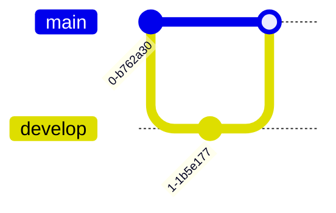

# Mermaid Diagrams

VMark supports [Mermaid](https://mermaid.js.org/) diagrams for creating flowcharts, sequence diagrams, and other visualizations directly in your Markdown documents.


## Inserting a Diagram

### Using Keyboard Shortcut

Type a fenced code block with the `mermaid` language identifier:

````markdown

````

### Using Slash Command

1. Type `/` to open the command menu
2. Select **Mermaid Diagram**
3. A template diagram is inserted for you to edit

## Editing Modes

### Rich Text Mode (WYSIWYG)

In WYSIWYG mode, Mermaid diagrams are rendered inline as you type. Click on a diagram to edit its source code.

### Source Mode with Live Preview

In Source mode, a floating preview panel appears when your cursor is inside a mermaid code block:


| Feature | Description |
|---------|-------------|
| **Live Preview** | See rendered diagram as you type (200ms debounce) |
| **Drag to Move** | Drag the header to reposition the preview |
| **Resize** | Drag any edge or corner to resize |
| **Zoom** | Use `−` and `+` buttons (10% to 300%) |

The preview panel remembers its position if you move it, making it easy to arrange your workspace.

## Supported Diagram Types

VMark supports all Mermaid diagram types:

### Flowchart


````markdown

````

### Sequence Diagram


````markdown

````

### Class Diagram


````markdown

````

### State Diagram


````markdown

````

### Entity Relationship Diagram


````markdown

````

### Gantt Chart


````markdown

````

### Pie Chart


````markdown

````

### Git Graph


````markdown

````

## Tips

### Syntax Errors

If your diagram has a syntax error:
- In WYSIWYG mode: the code block shows the raw source
- In Source mode: the preview shows "Invalid mermaid syntax"

Check the [Mermaid documentation](https://mermaid.js.org/intro/) for correct syntax.

### Pan and Zoom

In WYSIWYG mode, rendered diagrams support interactive navigation:

| Action | How |
|--------|-----|
| **Zoom** | Hold `Cmd` (macOS) or `Ctrl` (Windows/Linux) and scroll |
| **Pan** | Click and drag the diagram |
| **Reset** | Click the reset button that appears on hover (top-right corner) |

### Copy Mermaid Source

When editing a mermaid code block in WYSIWYG mode, a **copy** button appears in the edit header. Click it to copy the mermaid source code to the clipboard.

### Theme Integration

Mermaid diagrams automatically adapt to VMark's current theme (light or dark mode).

### Export as PNG

Hover over a rendered mermaid diagram in WYSIWYG mode to reveal an **export** button (top-right, to the left of the reset button). Click it to choose a theme:

| Theme | Background |
|-------|------------|
| **Light** | White background |
| **Dark** | Dark background |

The diagram is exported as a 2x resolution PNG via the system save dialog. The exported image uses a concrete system font stack, so text renders correctly regardless of the fonts installed on the viewer's machine.

### Export as HTML/PDF

When exporting the full document to HTML or PDF, Mermaid diagrams are rendered as SVG images for crisp display at any resolution.

## Fixing AI-Generated Diagrams

VMark uses **Mermaid v11**, which has a stricter parser (Langium) than older versions. AI tools (ChatGPT, Claude, Copilot, etc.) often generate syntax that worked in older Mermaid versions but fails in v11. Here are the most common issues and how to fix them.

### 1. Unquoted Labels with Special Characters

**The most frequent issue.** If a node label contains parentheses, apostrophes, colons, or quotes, it must be wrapped in double quotes.

````markdown
<!-- Fails -->
```mermaid
flowchart TD
    A[User's Dashboard] --> B[Step (optional)]
    C[Status: Active] --> D[Say "Hello"]
```

<!-- Works -->

````

**Rule:** If a label contains any of these characters — `' ( ) : " ; # &` — wrap the entire label in double quotes: `["like this"]`.

### 2. Trailing Semicolons

AI models sometimes add semicolons at line ends. Mermaid v11 does not allow them.

````markdown
<!-- Fails -->


<!-- Works -->
```mermaid
flowchart TD
    A --> B
    B --> C
```
````

### 3. Using `graph` Instead of `flowchart`

The `graph` keyword is legacy syntax. Some newer features only work with `flowchart`. Prefer `flowchart` for all new diagrams.

````markdown
<!-- May fail with newer syntax -->
```mermaid
graph TD
    A --> B
```

<!-- Preferred -->
```mermaid
flowchart TD
    A --> B
```
````

### 4. Subgraph Titles with Special Characters

Subgraph titles follow the same quoting rules as node labels.

````markdown
<!-- Fails -->
```mermaid
flowchart TD
    subgraph Service Layer (Backend)
        A --> B
    end
```

<!-- Works -->
```mermaid
flowchart TD
    subgraph "Service Layer (Backend)"
        A --> B
    end
```
````

### 5. Quick Fix Checklist

When an AI-generated diagram shows "Invalid syntax":

1. **Quote all labels** that contain special characters: `["Label (with parens)"]`
2. **Remove trailing semicolons** from every line
3. **Replace `graph` with `flowchart`** if using newer syntax features
4. **Quote subgraph titles** that contain special characters
5. **Test in the [Mermaid Live Editor](https://mermaid.live/)** to pinpoint the exact error

::: tip
When asking AI to generate Mermaid diagrams, add this to your prompt: *"Use Mermaid v11 syntax. Always wrap node labels in double quotes if they contain special characters. Do not use trailing semicolons."*
:::

## Teach Your AI to Write Valid Mermaid

Instead of fixing diagrams by hand every time, you can install tools that teach your AI coding assistant to generate correct Mermaid v11 syntax from the start.

### Mermaid Skill (Syntax Reference)

A skill gives your AI access to up-to-date Mermaid syntax documentation for all 23 diagram types, so it generates correct code instead of guessing.

**Source:** [WH-2099/mermaid-skill](https://github.com/WH-2099/mermaid-skill)

#### Claude Code

```bash
# Clone the skill
git clone https://github.com/WH-2099/mermaid-skill.git /tmp/mermaid-skill

# Install globally (available in all projects)
mkdir -p ~/.claude/skills/mermaid
cp -r /tmp/mermaid-skill/.claude/skills/mermaid/* ~/.claude/skills/mermaid/

# Or install per-project only
mkdir -p .claude/skills/mermaid
cp -r /tmp/mermaid-skill/.claude/skills/mermaid/* .claude/skills/mermaid/
```

Once installed, use `/mermaid <description>` in Claude Code to generate diagrams with correct syntax.

#### Codex (OpenAI)

```bash
# Same files, different location
mkdir -p ~/.codex/skills/mermaid
cp -r /tmp/mermaid-skill/.claude/skills/mermaid/* ~/.codex/skills/mermaid/
```

#### Gemini CLI (Google)

Gemini CLI reads skills from `~/.gemini/` or per-project `.gemini/`. Copy the reference files and add a instruction to your `GEMINI.md`:

```bash
mkdir -p ~/.gemini/skills/mermaid
cp -r /tmp/mermaid-skill/.claude/skills/mermaid/references ~/.gemini/skills/mermaid/
```

Then add to your `GEMINI.md` (global `~/.gemini/GEMINI.md` or per-project):

```markdown
## Mermaid Diagrams

When generating Mermaid diagrams, read the syntax reference in
~/.gemini/skills/mermaid/references/ for the diagram type you are
generating. Use Mermaid v11 syntax: always quote node labels containing
special characters, do not use trailing semicolons, prefer "flowchart"
over "graph".
```

### Mermaid Validator MCP Server (Syntax Checking)

An MCP server lets your AI **validate** diagrams before presenting them to you. It catches errors using the same parsers (Jison + Langium) that Mermaid v11 uses internally.

**Source:** [fast-mermaid-validator-mcp](https://github.com/ai-of-mine/fast-mermaid-validator-mcp)

#### Claude Code

```bash
# One command — installs globally
claude mcp add -s user --transport stdio mermaid-validator \
  -- npx -y @ai-of-mine/fast-mermaid-validator-mcp --mcp-stdio
```

This registers a `mermaid-validator` MCP server that provides three tools:

| Tool | Purpose |
|------|---------|
| `validate_mermaid` | Check a single diagram's syntax |
| `validate_file` | Validate diagrams inside Markdown files |
| `get_examples` | Get sample diagrams for all 28 supported types |

#### Codex (OpenAI)

```bash
codex mcp add --transport stdio mermaid-validator \
  -- npx -y @ai-of-mine/fast-mermaid-validator-mcp --mcp-stdio
```

#### Claude Desktop

Add to your `claude_desktop_config.json` (Settings > Developer > Edit Config):

```json
{
  "mcpServers": {
    "mermaid-validator": {
      "command": "npx",
      "args": ["-y", "@ai-of-mine/fast-mermaid-validator-mcp", "--mcp-stdio"]
    }
  }
}
```

#### Gemini CLI (Google)

Add to your `~/.gemini/settings.json` (or per-project `.gemini/settings.json`):

```json
{
  "mcpServers": {
    "mermaid-validator": {
      "command": "npx",
      "args": ["-y", "@ai-of-mine/fast-mermaid-validator-mcp", "--mcp-stdio"]
    }
  }
}
```

::: info Prerequisites
Both tools require [Node.js](https://nodejs.org/) (v18 or later) installed on your machine. The MCP server downloads automatically via `npx` on first use.
:::

## Learning Mermaid Syntax

VMark renders standard Mermaid syntax. To master diagram creation, refer to the official Mermaid documentation:

### Official Documentation

| Diagram Type | Documentation Link |
|--------------|-------------------|
| Flowchart | [Flowchart Syntax](https://mermaid.js.org/syntax/flowchart.html) |
| Sequence Diagram | [Sequence Diagram Syntax](https://mermaid.js.org/syntax/sequenceDiagram.html) |
| Class Diagram | [Class Diagram Syntax](https://mermaid.js.org/syntax/classDiagram.html) |
| State Diagram | [State Diagram Syntax](https://mermaid.js.org/syntax/stateDiagram.html) |
| Entity Relationship | [ER Diagram Syntax](https://mermaid.js.org/syntax/entityRelationshipDiagram.html) |
| Gantt Chart | [Gantt Syntax](https://mermaid.js.org/syntax/gantt.html) |
| Pie Chart | [Pie Chart Syntax](https://mermaid.js.org/syntax/pie.html) |
| Git Graph | [Git Graph Syntax](https://mermaid.js.org/syntax/gitgraph.html) |

### Practice Tools

- **[Mermaid Live Editor](https://mermaid.live/)** — Interactive playground to test and preview diagrams before pasting into VMark
- **[Mermaid Documentation](https://mermaid.js.org/)** — Complete reference with examples for all diagram types

::: tip
The Live Editor is great for experimenting with complex diagrams. Once your diagram looks right, copy the code into VMark.
:::
